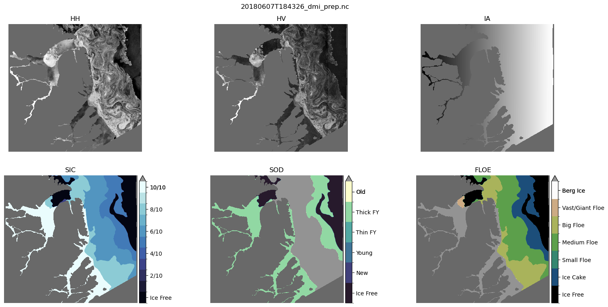

# Official code for MMSEAICE

This repository contains the official code for the MMSEAICE project. It includes all the necessary scripts and configurations to reproduce our winning solution.

## Key Features
- Custom configuration system for flexible model setup
- Integration with Weights & Biases (WandB) for experiment tracking
- Comprehensive data visualization tools
- Implements various strategies for enhanced accuracy, efficiency, and robustness:
  - Input SAR variable downscaling
  - Input feature selection
  - Spatial-temporal encoding
  - Optimized loss functions

This solution achieved top performance in the competition, demonstrating its effectiveness in accurately predicting sea ice maps. The code provided here allows for reproduction of our results and serves as a strong baseline for further research in this domain.


## Table of Contents
- [Key Features](#key-features)
- [Dependencies](#dependencies)
- [Running the Code](#running-the-code)
  - [Create a new environment](#create-a-new-environment)
  - [Activating the environment](#activating-the-environment)
  - [Requesting Interactive job](#requesting-interactive-job)
  - [Submitting a Job](#submitting-a-job)
- [Train the model](#train-the-model)
- [Testing the model](#testing-the-model)
- [Creating submission package](#creating-submission-package)
- [Data visualization](#data-visualization)
  - [Usage](#usage)
  - [Visualize imagery & charts for a single scene (from NetCDF)](#visualize-imagery--charts-for-a-single-scene-from-netcdf)
  - [Visualize imagery & charts for all scenes in a directory (from NetCDF)](#visualize-imagery--charts-for-all-scenes-in-a-directory-from-netcdf)
  - [Export imagery & charts from NetCDF to file](#export-imagery--charts-from-netcdf-to-file)
- [Acknowledgments](#acknowledgments)
- [Bibliography](#bibliography)


## Dependencies
The following packages and versions were used to develop and test the code along with the dependancies installed with pip:
- python==3.9.11
- jupyterlab==3.4.5
- xarray==2022.10.0
- h5netcdf
- numpy
- matplotlib
- torch==1.12.0
- tqdm==4.64.1
- sklearn
- jupyterlab
- ipywidgets
- icecream
- opencv-python-headless
- mmcv==1.7.1
- wandb

## Running the Code


### Create a new environment

These sections are specific to running the code on compute canada or any other slurm based HPC. If you have different compute medium pls skip to [Train the model](#Train-the-model).


By default, compute canada does not have support for Conda environments. So we'll use the inbuilt [venv](https://docs.python.org/3/library/venv.html) module to create new environments.

The repo contains a [create_env.sh](create_env.sh) which will create a virtual environment for you in **compute canada**.

To create a new environment ` bash create_env.sh <envname>`.
<br/> This will create a new env in the `~/<envname>` folder, at the root folder.

### Activating the environment

To activate the env, use the command `source ~/<envname>/bin/activate`. 


Running the code in compute canada can be done in two ways.
 1. Running the program interactively
 2. Running the program as a job

 We usually use the 1st method to test our code and some small visulization and the 2nd is to train the actual model

### Requesting Interactive job

To request the interactive job, run the following command

`salloc --nodes 1 --time=2:30:0 --tasks-per-node=1 --mem=32G --account=def-dclausi --gpus-per-node=v100l:1 --cpus-per-task=6`

This will request a machine with 32 GB ram, 6 cpu cores, 1 Tesla v100 GPU for 2hours and 30 minutes.

It may take some time for you to get resource allocation (play some pingpong meanwhile). After you get your resource allocated.

Run the following command

```sh
module purge
module load python/3.9.6
source ~/<envname>/bin/activate
```

Now everthing is ready. Now it'll be like you're running the programs on your local computer, ofcourse there will be no GUI.

### Submitting a Job

to submit job run

`sbatch compute_canada/submit/train_infer.sh <path_to_config_file> <-wandb-project-name>`

## Train the model

To start training the model, first creating a config file like [sic_mse.py](configs/sic_mse/sic_mse.py)

 Then run the [quickstart.py](quickstart.py) with path of the config file. This trains the model along with logging the metrics to WandB.

Run `quickstart.py <path_to_config_file.py> --wandb-project=<name_of_wandb_project> --workdir <path_to_a_folder>`

If `--workdir` is not specified, by default it will save the **model checkpoint**, **upload package** and **Inference on test images** in `workdir/config_file_name` <br>
else it will save everything in the specified folder.

Note: The concept of config was stolen from [mmcv config](https://mmcv.readthedocs.io/en/latest/understand_mmcv/config.html) file structure. 

## Testing the model

To test the model on test scenes and produce the metrics used in the competetion,

Run `python inference.py <path_to_config_file.py> <path to pytorch checkpoint file.pth>`

## Creating submission package

This script prepares the submission file for the competetition portal

Run `test_upload.py <path_to_config_file.py> <path to pytorch checkpoint file.pth>` 

## Data visualization

### Usage
All visualization code in this repository is in the `data_visualization` directory.

The `vis_single_scene.ipynb` notebook provides an example visualization and link to the plotting function.



This will plot the HH, HV channels along with the Ground truths: SIC, SOD, FLOE

#### Visualize imagery & charts for a single scene (from NetCDF):
`python r2t_vis.py {filepath.nc}`

#### Visualize imagery & charts for all scenes in a directory (from NetCDF):
`python vis_all_train.py {dir}`

#### Export imagery & charts from NetCDF to file:
`python export_data.py {in_dir} {out_dir}`

## Winning solution configuration:

The config file that helped us win the autoice competetion is avaliable at [sic_mse.py](configs/sic_mse/sic_mse.py)

We also experimented with numerous configaration such as changing input channels, loss functions, architectures, optimisers, patch size etc and such experiments can be found in the [config folder](configs/). 

## Acknowledgments

We would like to thank the organizers of the AutoICE challenge for providing the dataset and oranising the competetition.

## Bibliography

If you use our code or find our work helpful, please consider citing:

```bibtex
@article{chen2024mmseaice,
  title={MMSeaIce: a collection of techniques for improving sea ice mapping with a multi-task model},
  author={Chen, Xinwei and Patel, Muhammed and Pena Cantu, Fernando J and Park, Jinman and Noa Turnes, Javier and Xu, Linlin and Scott, K Andrea and Clausi, David A},
  journal={The Cryosphere},
  volume={18},
  number={4},
  pages={1621--1632},
  year={2024},
  publisher={Copernicus GmbH}
}

@article{chen2023weakly,
  title={Weakly Supervised Learning for Pixel-level Sea Ice Concentration Extraction using AI4Arctic Sea Ice Challenge Dataset},
  author={Chen, Xinwei and Patel, Muhammed and Xu, Linlin and Chen, Yuhao and Scott, K Andrea and Clausi, David A},
  journal={IEEE Geoscience and Remote Sensing Letters},
  year={2023},
  publisher={IEEE}
}

@article{chen2024comparative,
  title={A comparative study of data input selection for deep learning-based automated sea ice mapping},
  author={Chen, Xinwei and Cantu, Fernando J Pena and Patel, Muhammed and Xu, Linlin and Brubacher, Neil C and Scott, K Andrea and Clausi, David A},
  journal={International Journal of Applied Earth Observation and Geoinformation},
  volume={131},
  pages={103920},
  year={2024},
  publisher={Elsevier}
}

```